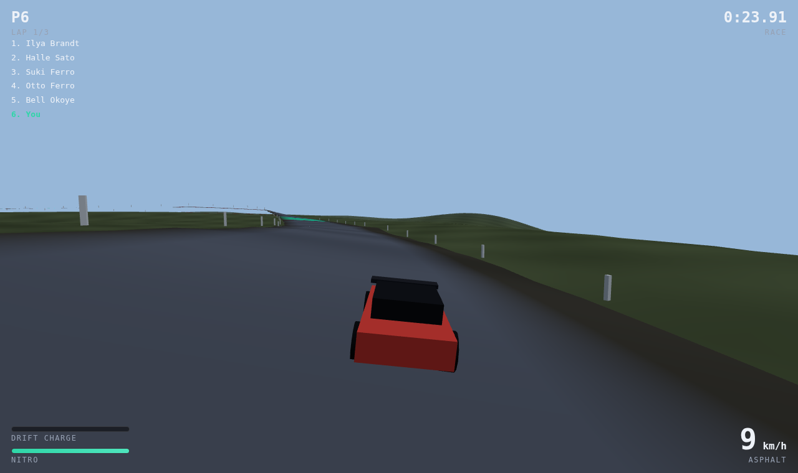
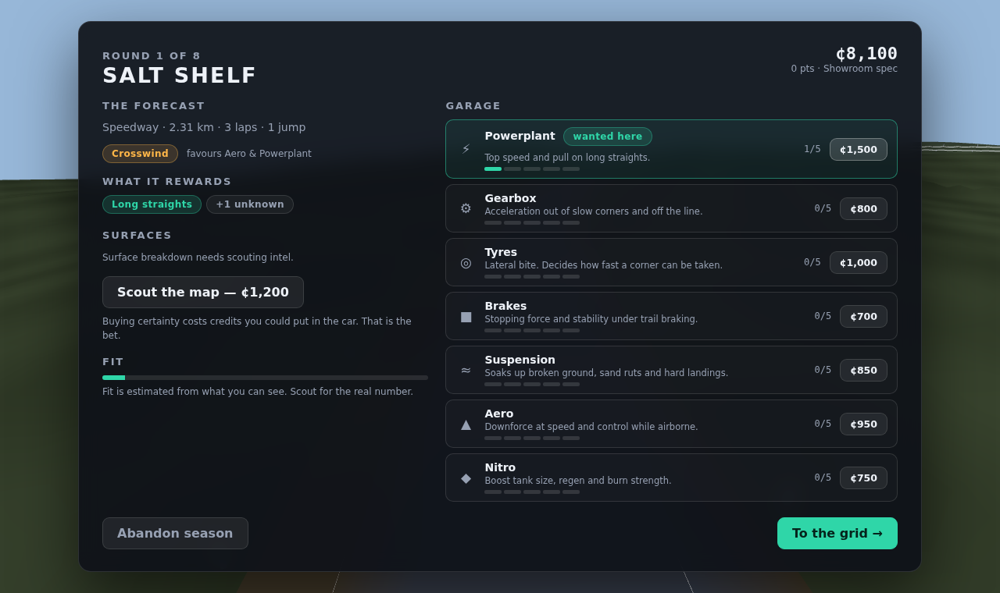

# Apex Drift

A 3D browser racing game where the map is rolled before every race, upgrades
decide the margin, and driving decides the result.

> Luck is a real winning factor. Skill is a bigger one.



## Run it

```bash
npm install
npm run dev          # http://127.0.0.1:5173
```

Or build the whole game into one self-contained HTML file — no modules, no CDN,
no separate assets — that plays anywhere you can open a page, phone included:

```bash
npm run artifact     # dist-artifact/apex-drift.html (~520 KB)
```

Touch controls appear automatically on a phone: steering under the left thumb,
throttle, brake, drift and boost under the right.

## How a season works

Eight rounds. Before each one a map is generated from a seed — its layout,
weather, surfaces and jumps are all rolled fresh.

1. **The forecast.** You see the biome, the length, the weather and **one** of
   the things the map rewards. The rest is hidden.
2. **The garage.** Spend on seven upgrades — powerplant, gearbox, tyres, brakes,
   suspension, aero, nitro. Or spend ¢1,200 on scouting intel and see exactly
   what the map wants before you commit. The intel and the car come out of the
   same pocket.
3. **The race.** Three laps against five rivals whose budgets grow with the
   season.
4. **The payout.** Position pays, but so does driving: drift time, clean
   landings, flawless laps, fastest lap, and a bonus for every better-funded car
   you beat.

Every map is finishable in any car. A map that wants tyres will punish a car
without them — but it will never strand you, and a driver who chains drift
boosts beats a better-funded one who doesn't.

## Controls

| | |
|---|---|
| `W` `A` `S` `D` / arrows | Drive |
| `Space` | Handbrake — provokes the slide that charges boost |
| `Shift` | Nitro |
| `R` | Rejoin the track |

A gamepad works if one is connected, and there are touch controls on phones.

**The drift economy is the whole skill ceiling.** Hold a slide near 25° to charge
boost, then straighten to release it — three tiers, bigger is better. Release it
*while nitro is burning* and the two fuse for a 1.35× exit. That is the fastest
thing in the game and it costs nothing but timing.

## The garage

Where the gamble happens. One trait tag is revealed, the rest are `+N unknown`,
and intel competes with the car for the same credits.



## The design, in numbers

The thesis is measured, not asserted:

| Budget | Measured swing in lap time |
|---|---|
| Skill | 30.5% |
| Vehicle stats | 21.0% |
| Map roll (luck) | 7.7% |

```bash
npm run balance   # the three budgets across 120 random maps
npm run sim       # live physics vs the pace model
npm run boost     # what a drift exit is actually worth
npm run spec      # whether building for a map beats hedging, at equal cost
npm run season    # eight-round seasons, played end to end
npm run smoke     # the real game in a real browser
```

Over a full season, driving better is worth **+56 championship points**;
allocating upgrades better is worth **+9**. Building for the map you think is
coming gains about half a finishing position when you guess right, and costs
about a third of one when you guess wrong.

Full write-up, including how a map's demands are measured off its own geometry
rather than authored by hand: [`docs/DESIGN.md`](docs/DESIGN.md).

## Layout

```
src/game/balance.js    every tunable, and the design thesis as constants
src/game/trackgen.js   seeded map generation + measured trait demands
src/game/pace.js       physics-derived speed profile, shared by AI and previews
src/game/vehicle.js    the car, and the drift-boost economy
src/game/ai.js         reference driver (pure pursuit) and rivals
src/game/race.js       race orchestration, standings, payouts
src/game/career.js     season, economy, partial-information reveal
src/render/            three.js scene, track and terrain meshes
src/ui/                HUD, garage, results
scripts/               the verification harnesses above
```

Built with [three.js](https://threejs.org) and Vite. No assets — the tracks,
cars and terrain are all generated.
